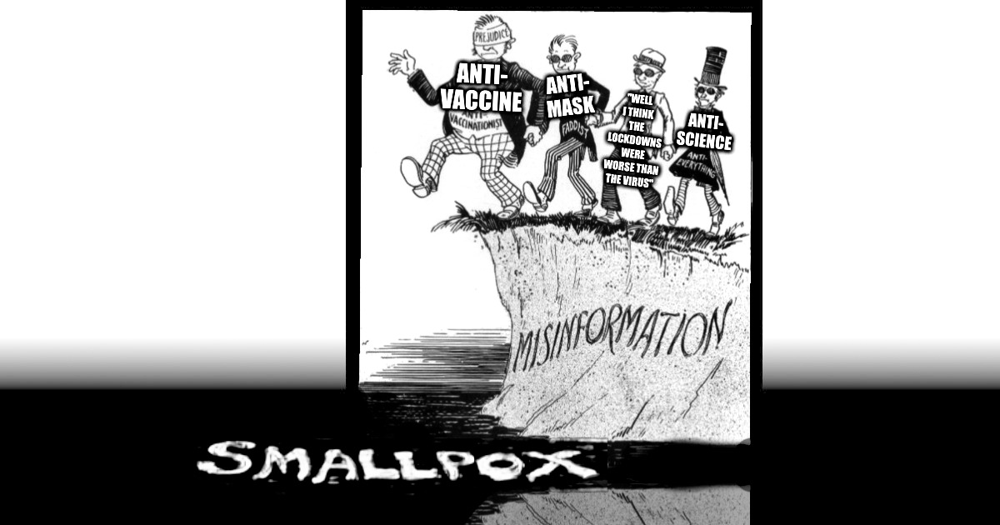
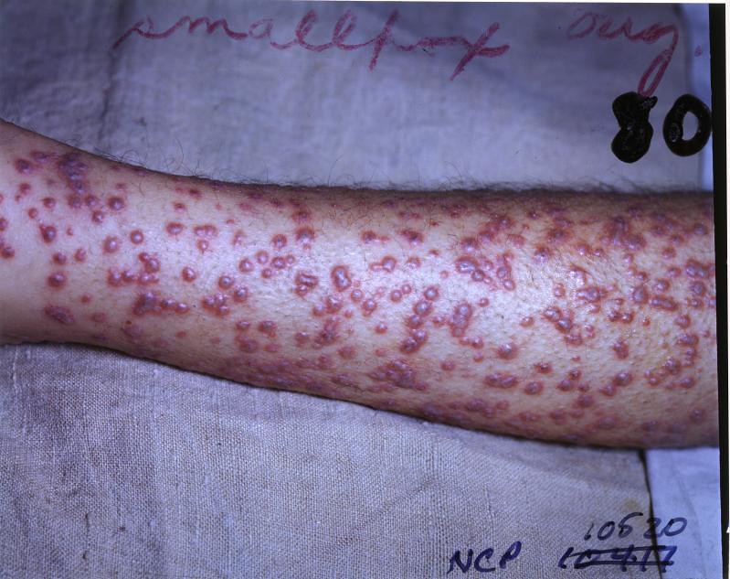

# Keep Smallpox Gone

> Green Mountain folks don't fall for smallpox misinformation.

Smallpox is an infectious disease caused by the Variola virus (often called Smallpox virus). The disease is characterized by fluid-filled blisters with a dent in the center.

Although the disease was officially eliminated in the 1980s through a global public health campaign, smallpox remains a serious risk if used as a biological weapon.

This document is a list of facts about smallpox for the general public.

##  Masks and disinfection

- Smallpox spreads through face-to-face contact between people.

- The incubation period (first exposure to contagious) is an average of 10 to 14 days.
 
- Initial symptoms include body aches, fever and vomiting.

- Sores develop in the throat or mouth.

- The virus spreads when droplets are coughed or sneezed.

- The virus can also spread on surfaces (or objects) contaminated by scabs or fluid from sores.

- The smallpox virus can survive on surfaces (and scabs) for months.

- A person remains contagious until the last scab falls off.

- Rigorous mask wearing and disinfection protocols can help prevent the spread of smallpox.
  
<figure>
  
  <figcaption>Smallpox blisters on an arm.</figcaption>
</figure>

## Vaccination

- The mpox vaccine (Jynneos) is approved to prevent smallpox.

- On average, a person infected with smallpox infects four to six other people.

- A global pandemic should slow if 5 out of every 6 people have immunity.

- The United States has stockpiled 300 million smallpox vaccines and 2 million courses of treatment―enough vaccines for the US to obtain herd immunity.

## Smallpox causes death and blindness

- Smallpox kills about one out of every three people infected.

- Smallpox blinds about one of every three people that survive.

## A smallpox epidemic would be disruptive

- A single modern case of smallpox is a global health emergency.

- The Centers for Disease Control (CDC) is responsible for positive identification, initial response, and coordinating containment of a case of smallpox.

- The Department of Health and Human Services (HHS) is responsible for distribution of vaccines from the Strategic National Stockpile (SNS).

- A global smallpox pandemic could kill up to 2.3 billion people.

- Although public health officials are often the first and loudest voices **against** mass quarantine to stop the spread of disease, it's likely that a sustained smallpox outbreak would be dangerous enough to warrant significant disruptions to daily life.

- Bad actors can be expected to use rumors of "lockdowns" on social media to cause panic and encourage exposed individuals to flee an outbreak epicenter, making an initial outbreak more difficult to contain.

## Smallpox history

- The first inoculation against smallpox was recorded in the 16th Century.

- Throughout history, people have used smallpox to their advantage by deliberately infecting their enemies with the disease.

- George Washington's choice to inoculate troops against smallpox in 1777 was a key tactical advantage in the Revolutionary War, which helped liberate the new country from the grip of a tyrant.

- Smallpox can only affect humans; there is no natural reservoir (other susceptible animal) for this virus.
  
- Smallpox is the first and only disease ended globally with vaccination.

- The US stopped recommending childhood vaccination for smallpox in 1971.

- Roughly 10k healthcare personnel and 150k military personnel were vaccinated against smallpox in the wake of the 9/11 terrorist attacks. 
  
- Healthcare professionals, first responders and National Guard members **are NOT vaccinated for smallpox**.

## Current context

- Since 2020, throughout the COVID-19 pandemic, enemies of the United States (both foreign and domestic) have been engaged in a persistent campaign to spread misinformation specifically calibrated to maximize damage from a deadly airborne pandemic.

- In the 2024 election cycle, leaders in the US threatened to weaponize disaster relief for political purposes.

- Political leaders in the US have threatened to detain marginalized groups and political opponents in crowded and unsanitary facilities.

- The United States is deporting (and threatening to deport) US citizens, migrants and visa holders to other countries, without due process.

- The United States has plans to build large detention centers and the logistical capacity to quickly expatriate a large number of people.

- For folks that may find themselves in a place where they are denied access to masks, basic sanitation, clean bedding or healthcare, a vaccine may be the best (and only) protection against smallpox (and other orthopox viruses).

## Future risk factors

- Heat stress is the leading cause of weather-related death. While public cooling centers can be a refuge for households without access to both air-conditioning and a power-backup, in the event of a smallpox epidemic, families may have to choose between braving a heat event or potentially being exposed to smallpox in a cooling center. The currently available mpox vaccine could effectively eliminate the risk of contracting smallpox in a cooling center.

- Individuals in groups that are being openly threatened with unlawful detention or deportation might consider preemptive vaccination with the currently available mpox vaccine to protect themselves. Additionally, vaccination can offer protection from being used as a bio-weapon within their group or as a living bio-weapon for export.

- Every year, the fraction of the total population born after 1971 with no immunity to smallpox increases by roughly 1.1%.

- While both Russia and the United States maintain live samples of smallpox, the technology to create a whole virus from the DNA sequence also becomes more readily available every year.