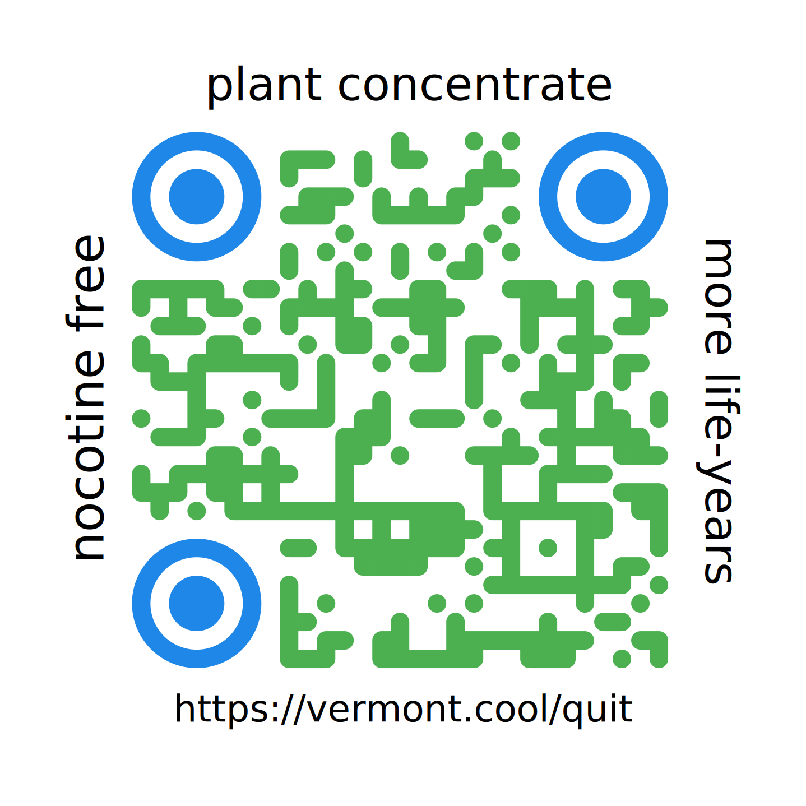

**Vermonters are increasingly using an old plant supplement to help themselves go nicotine free!**

It's called cytisine ([Tabex®](https://tabexsopharma.com/) or [Cravv®](https://www.zpharm.ca/)), it's been widely known about since World War II.

It can be purchased online from Europe and in person in Canada. 

Cytisine comes from the cytisus plant, a hearty shrub that grows in zones 5-8.  

**EVERYONE is TALKING ABOUT IT!!**

- **Legislators** are fretting about a potential drop in revenue from taxes on tobacco sales. 

- **Doctors, hospital administrators and health insurance CEOs** are already considering cutting back on vacations. 
- Working Vermonters are finding **thousands of dollars** showing up im their kitchen table accounting and getting a new lease on their health. 
- Even **non-smokers are excited** about potentially seeing their insurance premiums fall for once.

*What's all fuss about?* 

This FAQ is intended to answer some of your most pressing questions about this *old* natural remedy. 

## What is Cytisine?

- Cytisine is a plant supplement that acts as a mild nicotine inhibitor.
- Cytisine has been in use since 1964 and is currently available in 18 countries.
  
- It comes from [Cytisus](https://en.wikipedia.org/wiki/Cytisus), a genus of flowering plants in the family Fabaceae, native to open sites (typically scrub and heathland) in Europe, western Asia and North Africa.
- It is not a manufactured drug.
- It CANNOT be patented.

## Does cytisine work? 

The pharmaceutical giant Pfizer used what was widely known about cytisine to create a synthetic derivative called *varenicline*, which was then patented in various markets. 

In 2006, varenicline was granted priority review by the FDA, which expedited the review process to six months instead of the normal ten months.

The synthetic cousin was marketed as Chantix in the US, and Champix abroad. It retailed in the United States at roughly ten times the cost of the plant-based supplement from other countries. It was one of Pfizer's top 250 most lucrative medicines. 

In July 2021, Pfizer drug was recalled due to a impurity associated with a potential increased cancer risk in humans. 

Within two weeks, the FDA [issued a notice](https://www.fda.gov/drugs/drug-safety-and-availability/fda-updates-and-press-announcements-nitrosamine-varenicline-chantix) that it would allow distribution of tablets with unsafe levels of a known carcinogen (nitrosamine) to the public, stating publicly: 

> The health benefits of stopping smoking outweigh the cancer risk from the nitrosamine impurity in varenicline.

Pfizer expanded the scope of the recall three more times with additional lots after finding more impurities. The FDA reiterated guidance that patients should keep taking medicine with impunities associated with a potential increased cancer risk in humans.

However, because cytisine is not an approved treatment for nicotine cessation in the United States, we DO NOT and CANNOT LEGALLY directly answer the question of whether cytisine is effective for smoking cession, because such claims cannot be made, in the interest of public safety and science—in the US.

## Can I buy cytisine in the US? 

NO. 

The Food and Drug Administration has NOT approved cytisine as a treatment for quitting nicotine.

Cytisine is a plant that cannot be patented. The plant that it's derived from can grow in most of the US. 

There *seeds* are available for sale in the US online.

But there is no legal way that a pharmaceutical giant can price gouge a captive market on a vertical demand curve for a plant supplement. 

In August 2024, researchers estimated that making cytisine available immediately could lead approximately 71 000 more people to quit smoking over 1 year and maintain long-term abstinence, producing more than **500,000 additional life-years.** Each additional year of delay in the availability of cytisine might reduce population-level life expectancy by [10,000 years.](https://jamanetwork.com/journals/jama-health-forum/fullarticle/2822687)

So, ask your doctor if more **life-years®** are right for you, TODAY.

## Can I ask my primary care provider about cytisine? 

**YES, ABSOLUTELY.**

You **SHOULD** ask your primary care provider about cytisine.

You **SHOULD** ask your union representative if cytisine will be free in your union's plan. 

You **SHOULD** ask Vermont HealthConnect which plans will offer "free" cytisine. 

**Ask your pharmacist** if they sell Tabex® or Cravv®, at each visit. You do not have to be a smoker to ask. 

You can even ask **your compounding pharmacist** if they are able to compound a 25-day course of cytisine.

## Do other countries have cytisine? 

Yes. MANY.  

Cytisine is approved for nicotine cessation in Canada, the United Kingdom and New Zealand.

Cytisine is branded as [Tabex®](https://tabexsopharma.com/) and widely available in Europe. It's available in Cote d'Ivoire, Germany, Hungary, Italy, Spain, Sweden, Zambia, Azerbaijan, Bulgaria, and the Russian Federation. 

## Can I buy cytisine online?

Yes. Numerous websites sell [Tabex®](https://tabexsopharma.com/) online from Eastern Europe and will ship to the Untied States.

## Can I physically buy cytisine OUTSIDE the US?

Yes. 

- Cytisine is branded as [Cravv®](https://www.zpharm.ca/) in Canada.
- [Cravv®](https://www.zpharm.ca/) is available **over the counter** [throughout Ontario](https://www.zpharm.ca/locator/).

The nearest location to Vermont is the [Riverdale WholeHealth Pharmacy](https://wholehealthpharmacy.ca/store/riverdale-wholehealth-pharmacy/) in Cornwall Ontario:

    Whole Health Pharmacy Cornwall
    106 Second St W, Cornwall, ON K6J 1G5
    
Importation is technically illegal, but as policy, the FDA does NOT pursue legal action against individuals for the importation of plant supplements for personal use.

## How much is a course?

In 2025, a 25-day course costs about $50-60. Some users prefer to use two 25 day courses.

## Wait, I have a yard ... 

Seeds are available on etsy and ebay. 

Cytisus is a fantastic flowering shrub, recognizable thanks to its flush of upright, blooming branches.

It grows to be 2-6 feet tall.

More info about caring for [Cytisus broom shrubs HERE.](https://www.nature-and-garden.com/gardening/cytisus.html)

## Wait, I got a couple acres ... 

Learn more about the [State of the Art in Cytisine HERE](https://www.sciencedirect.com/science/article/pii/S075333222400091X)

## How can we get more people to see this? 

The stable URL for this document is https://vermont.cool/quit

This sticker design can be used wherever you find smokers.

## Want to know more?

[Article: There’s a Pill That Helps People Quit Smoking. Why Isn’t It Sold in the U.S.? - Even Canada has it. - Slate.com, 2023](https://slate.com/technology/2023/10/quitting-smoking-cytisine-varenicline-best-methods.html)

[Press Release: First large U.S. clinical trial of cytisinicline finds the smoking cessation medication effective and well tolerated - Massachusetts General Hospital, 2023](https://www.massgeneral.org/news/press-release/first-large-us-clinical-trial-of-cytisinicline-finds-the-smoking-cessation-medication-effective-and-well-tolerated)

[Opinion: Unavailability of varenicline: a global tragedy for the fight against the tobacco epidemic - The Lancet, 2023](https://www.thelancet.com/journals/lanres/article/PIIS2213-2600(23)00184-4/fulltext)

## No copyright

This document is placed in the public domain.