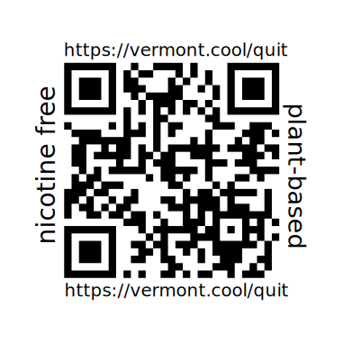

# It’s quittin' time

> Green Mountain folks won't be caught dead sucking a glowing nicotine stick.

Roughly [13% of Vermonters](https://www.healthvermont.gov/stats/surveillance-reporting-topic/tobacco-data) smoke cigarettes. Vermonters spend about [a million dollars](https://www.healthvermont.gov/sites/default/files/document/hpdp-tcp-vt-tobacco-sales-brief.pdf) every week on cigarettes alone. 

Approximately 1,000 Vermont adults die from a smoking-related illness each year. Smoking-related illness is a significant driver of healthcare costs, which impacts insurance premiums, compensation packages and finally all Vermonters' tax rates.

Roughly 44% of smokers attempt to quit each year. However, quitting nicotine can be very difficult. Some of the approved treatments aren't really treatments for nicotine addiction, but simply a less harmful method of taking the same drug.

+ [There is hope.](#there-is-hope)
+ [What is Cytisine?](#what-is-cytisine)
+ [Could I buy cytisine online from the US?](#could-i-buy-cytisine-online-from-the-us)
+ [Is it really expensive?](#is-it-really-expensive)
+ [Can I physically buy cytisine OUTSIDE the US?](#can-i-physically-buy-cytisine-outside-the-us)
+ [Can I buy cytisine in the US?](#can-i-buy-cytisine-in-the-us)
+ [Should I ask my primary care provider about cytisine?](#should-i-ask-my-primary-care-provider-about-cytisine)
+ [Do other countries have cytisine?](#do-other-countries-have-cytisine)
+ [Does cytisine really work?](#does-cytisine-really-work)
+ [Wait, I got a couple acres ...](#wait-i-got-a-couple-acres-)
+ [How can we get more people to see this?](#how-can-we-get-more-people-to-see-this)
+ [Want to know more?](#want-to-know-more)

## There is hope.

**Vermonters are increasingly using an old plant supplement to help themselves go nicotine free!**

It's been used for centuries throughout the world, found in various plants. 

In early America, for example, tribes of the Omaha harvested cytisine from the pods of the Kentucky coffee tree for medicinal use.

Today it's called *cytisine* (sold as [Tabex®](https://tabexsopharma.com/) and [Cravv®](https://www.zpharm.ca/)), it's been widely known about since World War II.

It can be purchased online from Europe and in person in Canada.   

**EVERYONE is TALKING ABOUT IT!!**

- **Legislators** are fretting about a potential drop in revenue from taxes on tobacco sales. 

- **Doctors, hospital administrators and health insurance CEOs** are already considering cutting back on vacations. 
- Working Vermonters are finding **thousands of dollars** showing up in their kitchen table accounting and getting a new lease on their health. 
- Even **non-smokers are excited** about potentially seeing their insurance premiums and property taxes fall for once. 

*What's all fuss about?* 

This FAQ is intended to answer some of your most pressing questions about this *old* natural remedy. 

## What is Cytisine?

- Cytisine is a plant supplement that acts as a mild nicotine inhibitor.
- Cytisine has been used to quit smoking since 1964 and is currently available in 18 countries.
  
- It comes from [Cytisus](https://en.wikipedia.org/wiki/Cytisus), a genus of flowering plants in the family Fabaceae, native to open sites (typically scrub and heathland) in Europe, western Asia and North Africa.
- It is not a manufactured drug.
- It CANNOT be patented.

## Could I buy cytisine online from the US?

**Yes.** Numerous websites sell [Tabex® manufactured by Sopharma](https://tabexsopharma.com/) online from Eastern Europe and will ship to the Untied States.

## Is it really expensive?

It's $50.

[Tabex®](https://tabexsopharma.com/) and [Cravv®](https://www.zpharm.ca/) both sell for about $50 for a 25 day course. 

Some users prefer to have two 25 day courses, which would leave them with extra, if they only used one.

If a pack-a-day smoker uses Tabex to quit by day 10 of a course, they should see a total return on their investment by day 14. The savings from the $50 investment will continue at $12-14 per day in perpetuity―savings of roughly $5k annually.

## Can I physically buy cytisine OUTSIDE the US?

**Yes.** 

- Cytisine is branded as [Cravv®](https://www.zpharm.ca/) in Canada.
- [Cravv®](https://www.zpharm.ca/) is available **over the counter** [throughout Ontario](https://www.zpharm.ca/locator/).

The nearest location to Vermont is the [Riverdale WholeHealth Pharmacy](https://wholehealthpharmacy.ca/store/riverdale-wholehealth-pharmacy/) in Cornwall Ontario:

    Whole Health Pharmacy Cornwall
    106 Second St W, Cornwall, ON K6J 1G5
    
Importation is technically illegal, but as policy, the FDA does NOT pursue legal action against individuals for the importation of plant supplements for personal use.

## Can I buy cytisine in the US? 

**NO.**

The Food and Drug Administration has NOT approved cytisine as a treatment for quitting nicotine.

Cytisine is a plant that cannot be patented. The plant that it's derived from can grow in most of the US. 

There are *seeds* are available for sale in the US online.

But there is no legal way that a pharmaceutical giant can price gouge a captive market on a vertical demand curve for a plant supplement. 

In August 2024, researchers estimated that making cytisine available immediately could lead approximately 71 000 more people to quit smoking over 1 year and maintain long-term abstinence, producing more than **500,000 additional life-years.** Each additional year of delay in the availability of cytisine might reduce population-level life expectancy by [10,000 years.](https://jamanetwork.com/journals/jama-health-forum/fullarticle/2822687)

So, ask your doctor if more **life-years®** are right for you, TODAY.

## Should I ask my primary care provider about cytisine? 

**YES**, absolutely.

You SHOULD ask your primary care provider if cytisine is right for you.

You SHOULD ask your union representative if cytisine will be free in your union's plan. 

You SHOULD ask Vermont HealthConnect which plans will offer "free" cytisine. 

Ask at the pharamacy if Tabex® or Cravv® is OTC at each visit. You do not have to be a smoker to ask. 

You can even ask your compounding pharmacist, if they are able to compound a 25-day course of cytisine.

## Do other countries have cytisine? 

**Yes,** of course.  

Cytisine is approved for nicotine cessation in Canada, the United Kingdom and New Zealand.

Cytisine is branded as [Tabex®](https://tabexsopharma.com/) and widely available in Europe. It's available in Cote d'Ivoire, Germany, Hungary, Italy, Spain, Sweden, Zambia, Azerbaijan, Bulgaria, and the Russian Federation. 

## Does cytisine really work? 

Well...

The pharmaceutical giant Pfizer used what was widely known about cytisine to create a synthetic derivative called *varenicline*, which was then patented in various markets. 

In 2006, varenicline was granted priority review by the FDA, which expedited the review process to six months instead of the normal ten months.

The synthetic cousin was marketed as Chantix in the US, and Champix abroad. It retailed in the United States at roughly ten times the cost of the plant-based supplement from other countries. It was one of Pfizer's top 250 most lucrative medicines. 

In July 2021, Pfizer drug was recalled due to a impurity associated with a potential increased cancer risk in humans. 

Within two weeks, the FDA [issued a notice](https://www.fda.gov/drugs/drug-safety-and-availability/fda-updates-and-press-announcements-nitrosamine-varenicline-chantix) that it would allow distribution of tablets with unsafe levels of a known carcinogen (nitrosamine) to the public, stating publicly: 

> The health benefits of stopping smoking outweigh the cancer risk from the nitrosamine impurity in varenicline.

Pfizer expanded the scope of the recall three more times with additional lots after finding more impurities. The FDA reiterated guidance that patients should keep taking medicine with impunities associated with a potential increased cancer risk in humans.

However, because cytisine is not an approved treatment for nicotine cessation in the United States, we DO NOT and CANNOT LEGALLY directly answer the question of whether cytisine is effective for smoking cession, because such claims cannot be made, in the interest of public safety and science—in the US.

## Wait, I got a couple acres ... 

Experienced growers may be interested in developing a cytisus operation as an enterprise.

Learn more about the [State of the Art in Cytisine HERE](https://www.sciencedirect.com/science/article/pii/S075333222400091X)

Note that some of the species in the genus are invasive. 

Cytisine is found in the cytisus plant, a hearty shrub that can grow in zones 5-8.

## How can we get more people to see this? 

The stable URL for this document is https://vermont.cool/quit

[These round sticker designs](./vermont.cool.quit.svg) can be used wherever you find smokers.

[Sheet stickers](./vermont.cool.vistaprint.3_1_sheet.svg) can fit nicely in notches of smokers' outposts.

Pull requests welcome. 

New stickers may also be submitted in the comments of [a new Issue](https://github.com/2qx/vermont.cool/issues/new).

## Want to know more?

[Article: There’s a Pill That Helps People Quit Smoking. Why Isn’t It Sold in the U.S.? - Even Canada has it. - Slate.com, 2023](https://slate.com/technology/2023/10/quitting-smoking-cytisine-varenicline-best-methods.html)

[Press Release: First large U.S. clinical trial of cytisinicline finds the smoking cessation medication effective and well tolerated - Massachusetts General Hospital, 2023](https://www.massgeneral.org/news/press-release/first-large-us-clinical-trial-of-cytisinicline-finds-the-smoking-cessation-medication-effective-and-well-tolerated)

[Opinion: Unavailability of varenicline: a global tragedy for the fight against the tobacco epidemic - The Lancet, 2023](https://www.thelancet.com/journals/lanres/article/PIIS2213-2600(23)00184-4/fulltext)

### Disclaimers

This is not medical advice. Consult a licensed medical professional if you have questions about your health.

### No copyright

This document is placed in the public domain.