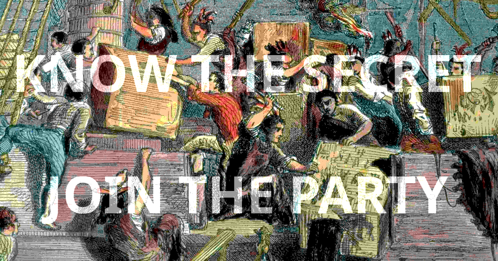

# Chucking our Boston tea habit

> Green Mountain folks don't drink hard brews laced with caffeine.

Young Vermonters are getting hooked on caffeinated alcoholic malt beverages & spiked tea. Many don't know what they're getting addicted to, or why they're drinking more. 

Here's the dangerous cocktail to look out for:

- 15-30 mg of caffeine per serving
- Non-carbonated drinkable beverage
- Cheap, using VT's 6% alcohol tax rate
- Sweet, colorful package, hip marketing
- The key: **caffeine is an open secret**

If this problem is on your roadside, it's in your oncoming traffic too―it will become reflected in your car insurance rates and rates for public emergency services.

Moreover, if young Vermonters destroy their livers, hearts and pancreases because no one told them the dirty little secret, it will affect what Vermonters pay collectively for healthcare in the decades to come. 

Worst of all, we're losing some of our fellow Vermonters to addiction because some Bostonian billionaires were allowed to extract a couple bucks slinging boxes of brews at young folks with a slyly laced gimmick.

If you've read this far, you know the secret; you're in the party.

+ [History rhymes with "poor foko"](#history-rhymes-with-poor-foko)
+ [A sweet trifecta for better drink sales](#a-sweet-trifecta-for-better-drink-sales)
+ [But I don't drink](#but-i-dont-drink)
+ [But caffeine doesn't effect me](#but-caffeine-doesnt-effect-me)
+ [One drug at a time](#one-drug-at-a-time)
+ [You're comin' for your coffee micro-brews!](#youre-comin-for-your-coffee-micro-brews)
+ [What to know more?](#what-to-know-more)
+ [Where's my sticker?](#wheres-my-sticker)
+ [Disclaimers](#disclaimers)

## History rhymes with "poor foko"

According to the CDC, drinking alcohol that is mixed with caffeine could lead to more drinking, injury, and risks to your health.

In the 2000s, companies began adding caffeine (about ~150 mg per serving) to alcoholic malt beverages and marketing those drinks to young audiences like energy drinks. 

In 2010, the Food and Drug Administration [warned](https://www.fda.gov/food/food-additives-petitions/caffeinated-alcoholic-beverages) four companies that caffeine is an "unsafe food additive" for alcoholic beverages.

The Alcohol and Tobacco Tax and Trade Bureau (TTB) [added that, given the above warning,](https://www.ttb.gov/main-pages/caffiene-added) they would consider them to be mislabeled under the Federal Alcohol Administration Act

The Federal Trade Commission [warned](https://www.ftc.gov/news-events/news/press-releases/2010/11/ftc-sends-warning-letters-marketers-caffeinated-alcohol-drinks) that that marketing of such beverages may constitute an unfair or deceptive practice that violates the FTC Act

Despite all that, in 2025, one of the most common beverages littering Vermont roadsides is a beverage with 30 milligrams of caffeine per 12 ounce can. Meaning a six-pack contains roughly 180 milligrams, or about as much as a large cup of coffee.

With tea flavored malt beverages, the caffeine is added with a naturally occurring compound in the flavoring. So not only did the sale of the beverage remain legal, **there is no warning that mixing alcohol and caffeine is considered more dangerous**, nor is there even an indication on the label that the **alcoholic beverage even contains caffeine**.

## A sweet trifecta for better drink sales

Alcoholic beverages with added caffeine were banned in 2010, because they were so dangerous a significant fraction of the customer base was landing in the emergency room or a morgue.

The FDA recommends a maximum intake of 400 mg of caffeine per day. Four alcoholic beverages with 150 mg of caffeine was putting kids over the recommended limit, but as the CDC notes: "When caffeine is used with alcohol, it does not reduce the effects of alcohol on your body." Decision making skills deteriorated from there.

Beverages with high-levels of caffeine were an obvious and self-limiting problem warranting immediate intervention to protect the public health. 

However, in low dosages, caffeine is still a mildly addictive stimulant. Adding it to sugary alcoholic beverages became a winning trifecta for increased beverage sales. Customers become better physically and psychologically hooked into a drinking habit, without knowing why.

In contrast to a light beer or hard seltzer, non-carbonated drinks went down smoother than their carbonated counterparts. 

With malted tea flavored beverages, there is NO WARNING or label on the can (or box) indicating that the product was a better optimized version of a banned cocktail. This secrecy was key. 

## But I don't drink

If you drive a road littered with tea flavored malted beverage cans, you're driving with increased risk. 

If you're getting in a friend's car, partying with other people, or know someone struggling with addiction, knowing about increased risks of mixing caffeine with alcohol can help you and those around you.

## But caffeine doesn't effect me

Okay bud. You and everyone else. 

Caffeine can be a *subtle* addition, with very mild addictive qualities and mild withdraw symptoms. People often don't notice they're addicted even when they break a daily routine.

Combined with alcohol and sugar, most people aren't going to notice 30 milligrams of caffeine. But for a daily drinker, it adds up and would probably lead to a noticeable headache, if a routine was broken. 

## One drug at a time

Looking to kick the tea habit?

There's lots of caffeinated beverages people tend to drink in the morning, and lots of alcoholic beverages some people can enjoy responsibly toward the end of the day.

There are lots of places in Vermont to get a sugary latte, or a sugary tea beverage. Drinking one energy drink would be the equivalent of six tea beverages, and much cheaper. 

There are, of course, a host of non-caffeinated spiked cocktails, or canned alcoholic beverages.

Be wary of "ready to drink" (RTD) spiked cola cocktails (with 30 mg of caffeine per serving).

## You're comin' for your coffee micro-brews!

If Montpelier began to consider regulating, taxing or banning caffeinated alcoholic beverages, Bostonians may try to fear-monger to gain some local allies, but Vermont's micro-breweries simply aren't producing caffeinated coffee beer to be pounded by the case. 

There are many reasons thick coffee beers from local micro-breweries aren't sold in 12-packs at gas stations, despite Vermont having more breweries per capita than any other state. 

The spiked coffee market is being developed by a Massachusets company. It's recently introduced a range of 5-6% ABV coffee and tea flavored malt beverages. The beverages come in 12 packs boxes of 12 oz cans. Although a single shot of espresso has about 65 of caffeine, no beverage in this new line-up has more than 30 mg of caffeine. Heavy drinkers could drink a 12-pack over the course of a day (360mg total), but not exceed the daily FDA recommended maximum intake of 400 mg of caffeine.

However, since it's no secret that coffee contains caffeine, a malted coffee beverages probably won't be as successful as a tea beverage, because the gimmick that makes coffee addictive is more obvious to the consumer.

## What to know more?

[Overview: The Side Effects of Mixing Alcohol and Caffeine](https://www.joinreframeapp.com/blog-post/the-side-effects-of-mixing-alcohol-and-caffeine)

[Article: Alcohol and Caffeine: The Perfect Storm](https://pmc.ncbi.nlm.nih.gov/articles/PMC3621334/)

[Article: Why Are Caffeinated Alcoholic Energy Drinks Dangerous?](https://www.scientificamerican.com/article/caffeine-alcohol-mix-dangerous/)

## Where's my sticker?

Here you go.

This sticker is for cool kids to raise awareness about the subtle addictive and dangerous effects of caffeine mixed with alcohol. 

The stable URL for this document is https://vermont.cool/teaparty

## Disclaimers

This is not medical advice. Consult a licensed medical professional if you have questions about your health.

### Need help with substance abuse?

VT Helplink is a service contracted by Vermont Department of Health to connect Vermonters with providers specializing in treatment services in their area.

Visit [VTHelplink.org](https://vthelplink.org) or call [802-565-LINK (5465)](tel:8025655465) (toll-free [833-565-LINK](tel:8335655465)) 24 hours a day, 365 days a year. 

**If you don't feel comfortable** giving personal information or discussing your health, insurance or legal status with VT Helplink, their website has a [search function](https://hub.vthelplink.org/spa_result) for local support services including *free* anonymous groups for **ALL**.

### No copyright

This document is placed in the public domain.