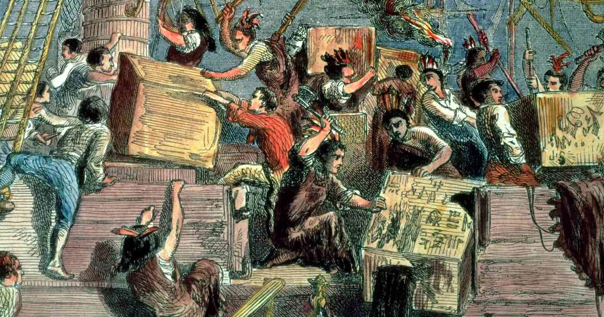
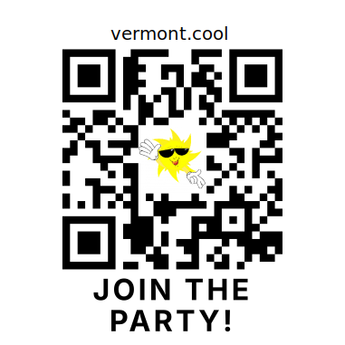

# Chuck that Boston tea habit

> Green Mountain folks won't drink malt brews laced with caffeine.

According to the CDC, drinking alcohol that is mixed with caffeine could lead to more drinking, injury, and risks to your health.

In the 2000s, companies began adding caffeine (about ~150 mg per serving) to alcoholic malt beverages and marketing those drinks to young audiences like energy drinks. 

In 2010, the Food and Drug Administration [warned](https://www.fda.gov/food/food-additives-petitions/caffeinated-alcoholic-beverages) four companies that caffeine is an "unsafe food additive" for alcoholic beverages.

The Alcohol and Tobacco Tax and Trade Bureau (TTB) [added that, given the above warning,](https://www.ttb.gov/main-pages/caffiene-added) they would consider them to be mislabeled under the Federal Alcohol Administration Act

The Federal Trade Commission [warned](https://www.ftc.gov/news-events/news/press-releases/2010/11/ftc-sends-warning-letters-marketers-caffeinated-alcohol-drinks) that that marketing of such beverages may constitute an unfair or deceptive practice that violates the FTC Act

**Despite all that, in 2025, one of the most common beverages littering Vermont roadsides is a beverage with 30 milligrams of caffeine per 12 ounce can.** Meaning a six-pack contains roughly 180 milligrams, or about as much as a large cup of coffee.

With tea flavored malt beverages, the caffeine is added with a naturally occurring compound in the flavoring. So not only did the sale of the beverage remain legal, **there is no warning that mixing alcohol and caffeine is considered more dangerous**, nor is there even an indication on the label that the **alcoholic beverage even contains caffeine**.

+ [A sweet trifecta for better drink sales](#a-sweet-trifecta-for-better-drink-sales)
+ [But caffeine doesn't effect me!](#but-caffeine-doesnt-effect-me)
+ [Just pick one drink at a time](#just-pick-one-drink-at-a-time)
+ [They're comin' for coffee micro-brew NEXT!](#theyre-comin-for-coffee-micro-brew-next)
+ [What to know more?](#what-to-know-more)
+ [Where's my sticker?](#wheres-my-sticker)
+ [Disclaimers](#disclaimers)

## A sweet trifecta for better drink sales

Alcoholic beverages with added caffeine were banned in 2010, because they were so dangerous they were killing their customer base. 

As the CDC notes: "When caffeine is used with alcohol, it does not reduce the effects of alcohol on your body."

While many drinkers can easily binge drink a case of hard beverages, if most people drank six coffees or energy drinks, they would have heart palpitations and serious mood changes―which is half of why beverages with 150 mg of caffeine per serving were banned.

However, in low dosages, caffeine is still a mildly addictive stimulant, so adding it to a sugary alcoholic beverage was a trifecta for increasing sales. 

In contrast to a light beer or hard seltzer, a non-carbonated beverage can be easier to drink more quickly than a carbonated counterparts. Meaning habitual drinkers can easily become more addicted and drink more. 

Again, there is NO WARNING or label on the can or box indicating that the product was a better optimized version of a banned cocktail. 

## But caffeine doesn't effect me!

Okay bud. You and everyone else. 

Caffeine can be a *subtle* addition, with very mild addictive qualities and mild withdraw symptoms. People often don't notice they're addicted even when they break a daily routine.

Combined with alcohol and sugar, most people aren't going to notice 30 milligrams of caffeine. But for a daily drinker, it adds up and would probably lead to a noticeable headache, if a routine was broken. 

## Just pick one drink at a time

There's lots of caffeinated beverages people tend to drink in the morning, and lots of alcoholic beverages some people can enjoy responsibly toward the end of the day.

There are lots of places in Vermont to get a sugary latte, or a sugary tea beverage. Drinking one energy drink would be the equivalent of six tea beverages, and much cheaper. 

There are of course a host of non-caffeinated spiked cocktails, or canned alcoholic beverages.

## They're comin' for coffee micro-brew NEXT!

There are many reasons thick coffee beers from local micro-breweries aren't sold in 12-packs at gas stations, despite Vermont having more breweries per capita than any other state. 

If Montpelier began to consider regulating, taxing or banning caffeinated alcoholic beverages, Bostonians may try to fear-monger local brewers and gain some allies, but micro-breweries simply aren't producing caffeinated coffee beer to be pounded by the case. 

The spiked coffee market is being developed in Vermont by another Massachusets company. It's recently introduced a range of 5-6% ABV coffee and tea flavored malt beverages. The beverages come in 12 packs of 12 oz cans. Although a single shot of espresso has about 65 of caffeine, no beverage in this new line-up has more than 30mg of caffeine. Heavy drinkers could drink a 12-pack over the course of a day (360mg total), but not exceed the daily FDA recommended maximum intake of 400 mg of caffeine.

## What to know more?

[Overview: The Side Effects of Mixing Alcohol and Caffeine](https://www.joinreframeapp.com/blog-post/the-side-effects-of-mixing-alcohol-and-caffeine)

[Article: Alcohol and Caffeine: The Perfect Storm](https://pmc.ncbi.nlm.nih.gov/articles/PMC3621334/)

[Article: Why Are Caffeinated Alcoholic Energy Drinks Dangerous?](https://www.scientificamerican.com/article/caffeine-alcohol-mix-dangerous/)

## Where's my sticker?

Here you go.

This sticker is for cool kids to raise awareness about the subtle addictive and dangerous effects of caffeine mixed with alcohol. 

The stable URL for this document is https://vermont.cool/teaparty

## Disclaimers

This is not medical advice. Consult a licensed medical professional if you have questions about your health.

### Need help with substance abuse?

Deciding to seek treatment for a substance use problem can be difficult but it is a step toward a healthier life. Whether you're seeking help for yourself or someone you care about, VT Helplink is Vermont’s connection to substance use disorder treatment programs and other alcohol & drug support services. 

VT Helplink is a free resource for Vermonters, providing confidential, non-judgmental support and referrals based on your specific needs. No matter where in Vermont you are, a caring Helplink Specialist will listen to you, answer your questions, and help you or your loved one take a step toward recovery.

If you are unsure what treatment is right for you or a loved one, or if you would like help finding a treatment provider near you, contact VT Helplink.

Visit [VTHelplink.org](https://vthelplink.org) or call [802-565-LINK (5465)](tel:8025655465) (toll-free [833-565-LINK](tel:8335655465)) 24 hours a day, 365 days a year. 

**If you don't feel comfortable** giving personal information or discussing your health, insurance or legal status with VT Helplink, their website has a [search function](https://hub.vthelplink.org/spa_result) for local support services including *free* anonymous groups for **ALL**.

### No copyright

This document is placed in the public domain.